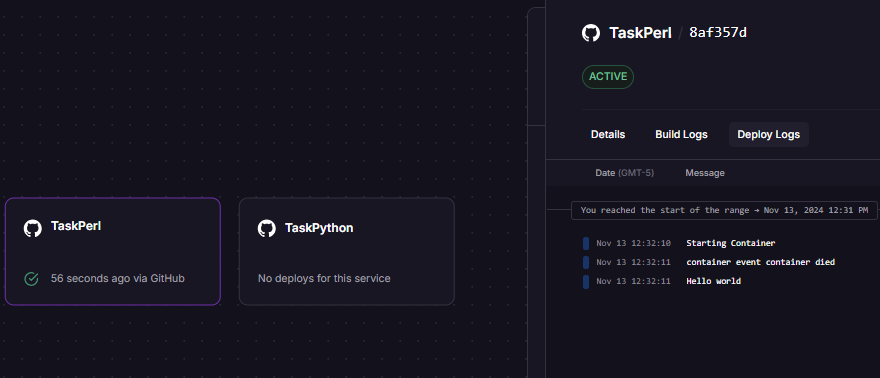
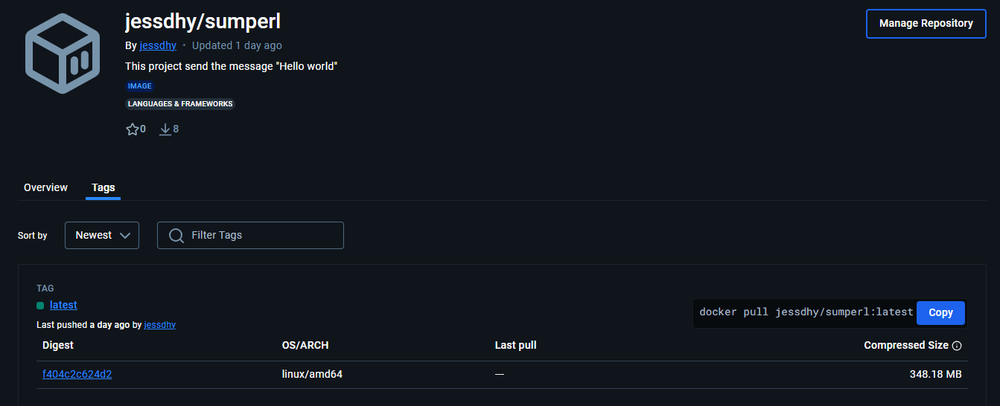

# 🌍👋 Hello world in perl 


## 📘 About The Project
The project was developed on Ubuntu and prints the message 'Hello World' to the console using Perl.

## 📑 Table of Contents

- [📘 About The Project](#about-the-project)
- [🚀 Getting Started](#getting-started)
  - [🔧 Prerequisites](#prerequisites)
  - [📥 Installation](#installation)
  - [⚙️ Running](#running)
  - [🐳 Running with Docker](#running-with-docker)
- [🤝 Contributing](#contributing)

## 🚀 Getting Started
## 🔧 Prerequisites
**Perl**: This project requires **Perl 5.34.0**. Make sure you have this version installed on your system.
You can check your Perl version by running:
```bash
perl -v
 ```
## 📥 Installation

1.- Clone the repository

   ```sh
   git clone https://github.com/Jesdhy/TaskPerl.git
  ```

## ⚙️ Running

  ```sh
    perl app.pl
   ```

## 🐳 Running with docker


1.- Making Docker Pull or Build docker image

 ```sh
   docker pull jessdhy/sumperl:latest
   ```
2.- Last make a docker run

 ```sh
   docker run -it jessdhy/sumperl
   ```
Where <any-name> is the name or tag you gave the image in the previous step.


## 🤝 Contributing
Thank you for your interest in contributing to this project! Here are some guidelines for doing so:
1. **Fork the repository** and clone the project to your local machine.
2. **Create a new branch** for your changes.
3. **Commit your changes** with a clear, descriptive message.
4. **Submit a Pull Request** with a description of your changes.

Thank you for helping improve this project!